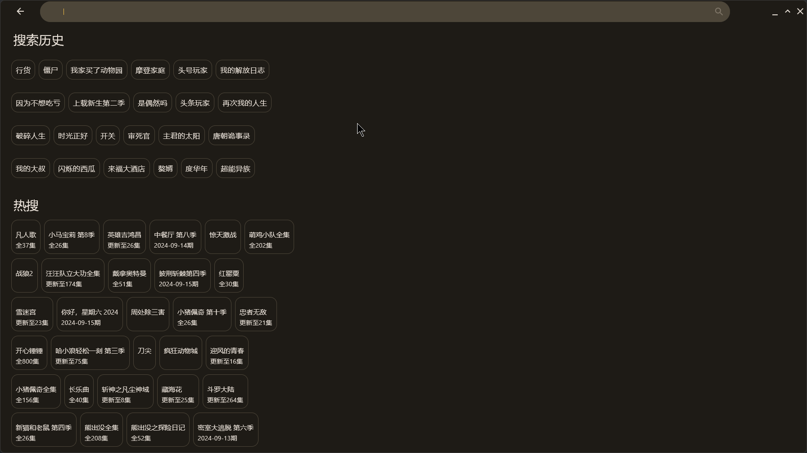

# TV-Multiplatform
本项目基于[jetbrain/KMP](https://github.com/JetBrains/compose-multiplatform-desktop-template#readme)
, [fonmi/TV](https://github.com/FongMi/TV). 名称中的multiplatform指的是compose-multiplatform所提供的多平台能力，但是本项目现阶段只使用桌面版本。
使用方式和fonmi/TV类似， 使用动态加载jar的方式获取需要展示的数据。需要结合为本项目定制的spider使用

# 声明
- 本项目现在只支持java爬虫，JS和Py暂时没有计划，过多类型的语言现在感觉不是很有必要。编写爬虫现在还是有门槛， 语言多也不会有很多人贡献代码。
- 如需使用内部播放器，请安装vlc
- 需要调用外部的播放器软件，可以通过命令行传递视频网络地址的播放器都可以使用, potplayer无法拖进度条,不推荐。
  1. vlc
  2. mpc-hc
  3. mpv 等
- 本项目按道理支持win(10/11)/linux/macos, 但只在win上测试过
- 配置播放器, 使用内部播放器需要安装vlc如果无法自动找到vlc， 可以在输入框中输入vlc可执行文件的路径。
- 常见问题/提问须知： https://telegra.ph/TV-Multiplatform%E5%B8%B8%E8%A7%81%E9%97%AE%E9%A2%98-04-20

# TODO
- [x] Decompose
- [x] 关于页
- [x] 优化日志设置 debug log 设置读取
- [x] 优化从搜索页进入详情页的时候使用的搜索结果集
- [x] 优化搜索调用次数,搜索页搜索时，默认搜索两个站源，如果为空则继续搜索，如过用户想加载更多，手动点击加载更多的按钮
- [x] vlcj
- [ ] webview
- [ ] 下载 aria2
- [ ] 支持文件夹浏览
- [ ] 自更新
  
# screenshoot
## 首页

## 搜索

## 搜索结果页

## 历史记录

## 详情页
### 内部播放器

### 外部播放器

## 设置页

# 讨论群
[TG](https://t.me/tv_multiplatform)

# 引用
player: https://github.com/numq/jetpack-compose-desktop-media-player
