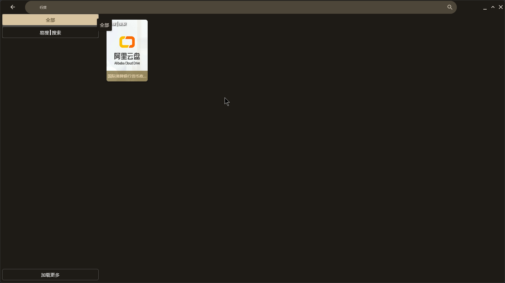
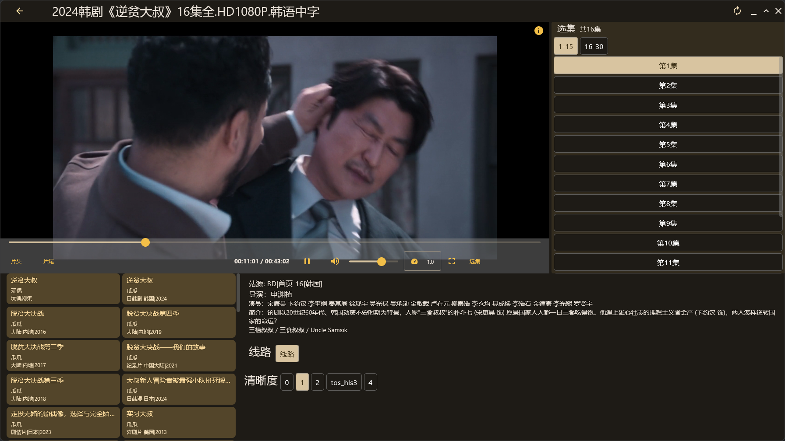
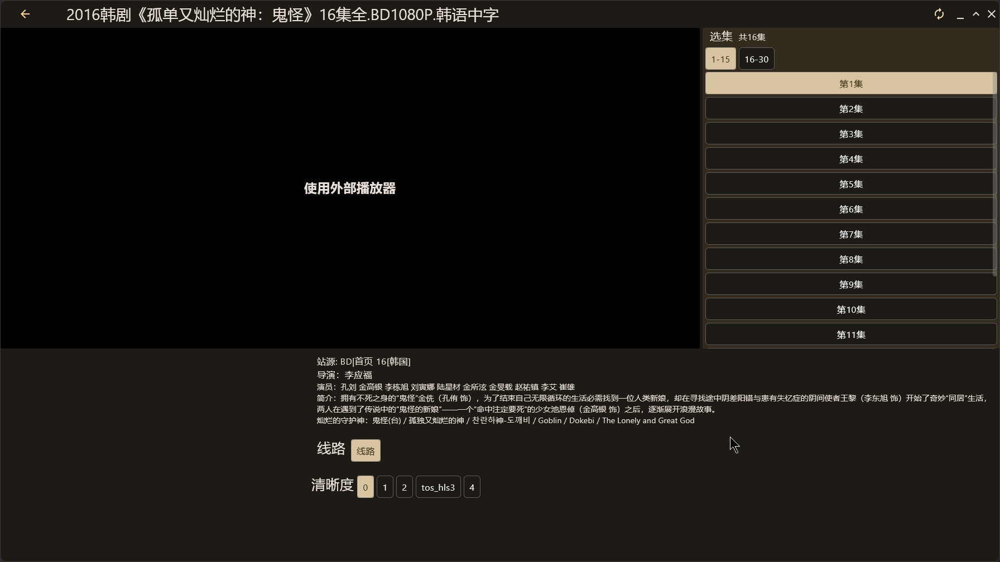
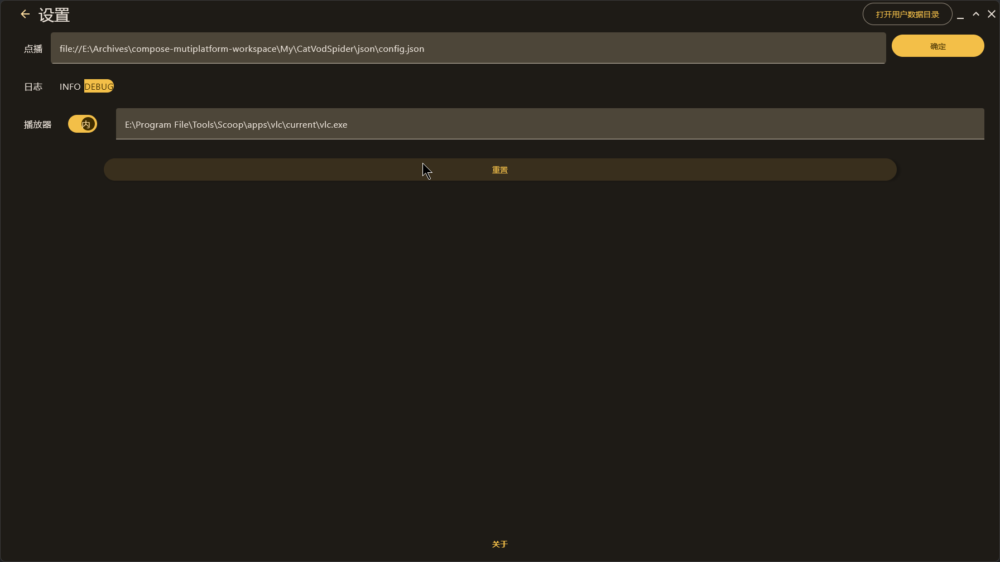

 
# LumenTV Compose
本项目基于 [TV-Multiplatform](https://github.com/Greatwallcorner/TV-Multiplatform)，[jetbrain/KMP](https://github.com/JetBrains/compose-multiplatform-desktop-template#readme)，[fonmi/TV](https://github.com/FongMi/TV)。名称中的 `Compose` 指的是 `compose-multiplatform` 所提供的多平台能力，但是本项目现阶段只使用桌面版本。使用方式和 `fonmi/TV` 类似，使用动态加载 `jar` 的方式获取需要展示的数据。需要结合为本项目定制的 `spider` 使用。
- 本项目使用的爬虫：[CatVodSpider](https://github.com/clevebitr/CatVodSpider)
## 核心功能

### 爬虫支持
- 本项目现在只支持 Java 爬虫，JS 和 Py 暂时没有计划，过多类型的语言现在感觉不是很有必要。编写爬虫现在还是有门槛，语言多也不会有很多人贡献代码。

### 混淆M3U8链接播放
本项目支持播放经过简单混淆的M3U8文件，如果遇到通过图床传输数据的M3U8文件时会切换到系统默认浏览器播放。
- **WebPlayer**：通过分析 M3U8 文件中的 链接后缀名 来判断是否为混淆链接，如果为png格式的混淆链接会通过浏览器播放。
- 注意：WebPlayer只支持M3U8格式的视频播放。

### 播放器支持
- **内部播放器**：如需使用内部播放器，请安装 VLC。如果无法自动找到 VLC，可以在输入框中输入 VLC 可执行文件的路径。
- **外部播放器**：需要调用外部的播放器软件，可以通过命令行传递视频网络地址的播放器都可以使用，`potplayer` 无法拖进度条，不推荐。支持的外部播放器有：
  1. VLC
  2. MPC - HC
  3. MPV 等

### 广告过滤功能
本项目基于 [M3U8 Filter Ad Script](https://github.com/ltxlong/M3U8-Filter-Ad-Script) 的重构kotlin实现的广告过滤功能，可有效拦截和过滤 M3U8 视频切片（插播）广告。该功能支持自动判断和暴力拆解两种模式，同时会在控制台打印过滤的行信息，不会误删正常视频内容。
- **自动判断模式**：通过分析 M3U8 文件中的 `EXTINF` 标签和 `ts` 序列号等信息，智能识别广告段并进行过滤。
- **暴力拆解模式**：在自动判断模式无法准确过滤时，可切换到暴力拆解模式，对可能的广告段进行强制过滤。
- **注意，开启广告过滤功能会影响m3u8文件解析的速度**

### 爬虫可用性检测
- 支持检测爬虫可用性，通过发送请求获取响应码来判断爬虫是否可用。
- 普通检测模式：通过发送请求获取响应码
- 搜索检测模式：通过发送请求获取响应码和响应头，判断是否为搜索结果页

### DLNA投屏支持
- 支持 DLNA投屏功能，同时支持内部/外部播放器播放，但是不支持控制手机控制进度条/音量设置。

### 平台支持
本项目按道理支持 `win(10/11)/linux/macos`，但只在 `win` 上测试过。

## 关于讨论群
本项目无讨论群！不要在原项目 tg 群里提及有关该项目问题！

## 声明
- 本项目使用的广告过滤功能基于 [M3U8 Filter Ad Script](https://github.com/ltxlong/M3U8-Filter-Ad-Script)，遵循其开源协议。
- 本项目仅用于学习和技术交流，请勿用于商业用途。

## TODO
- [x] Decompose
- [x] 关于页
- [x] 优化日志设置 debug log 设置读取
- [x] 优化从搜索页进入详情页的时候使用的搜索结果集
- [x] 优化搜索调用次数,搜索页搜索时，默认搜索两个站源，如果为空则继续搜索，如过用户想加载更多，手动点击加载更多的按钮
- [x] vlcj
- [x] 支持文件夹浏览
- [X] WebPlayer
- [X] 明/暗色主题实现
- [X] 支持广告过滤
- [ ] 自更新
- [ ] 下载 aria2

## 截图
## 首页

### 历史记录

### 搜索

### 搜索结果页

## 详情页
### 内部播放器

### 外部播放器

### Web播放器

### 设置页

## 引用
- player: https://github.com/numq/jetpack-compose-desktop-media-player
- animeko: https://github.com/open-ani/animeko?tab=readme-ov-file
- 广告过滤脚本: https://github.com/ltxlong/M3U8-Filter-Ad-Script
