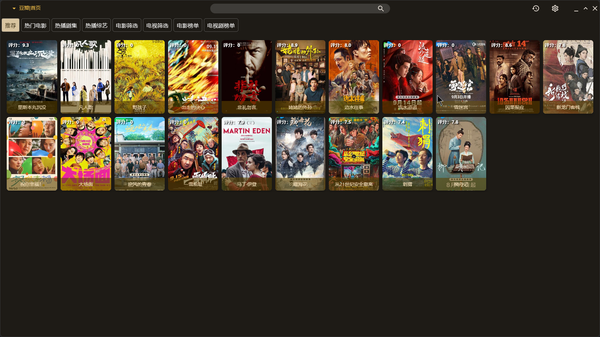

# TV-Multiplatform
本项目基于[jetbrain/KMP](https://github.com/JetBrains/compose-multiplatform-desktop-template#readme)
, [fonmi/TV](https://github.com/FongMi/TV). 名称中的multiplatform指的是compose-multiplatform所提供的多平台能力，但是本项目现阶段只使用桌面版本。
使用方式和fonmi/TV类似， 使用动态加载jar的方式获取需要展示的数据。需要结合为本项目定制的spider使用

# 声明
- 本项目现在只支持java爬虫，JS和Py暂时没有计划，过多类型的语言现在感觉不是很有必要。编写爬虫现在还是有门槛， 语言多也不会有很多人贡献代码。
- 自带mpc-hc
- 需要调用外部的播放器软件，可以通过命令行传递视频网络地址的播放器都可以使用, potplayer无法拖进度条,不推荐。
  1. vlc
  2. mpc-hc
  3. mpv 等
- 本项目按道理支持win/linux/macos, 但只在win上测试过

# TODO
- [x] Decompose
- [ ] vlcj
- [ ] 优化日志设置 debug log 设置读取
- [ ] 优化搜索调用次数
- [ ] 支持文件夹浏览
- [ ] 自更新
- 动画
- 代码优化
  
# screenshoot
## 首页

## 搜索

## 历史记录

# 讨论群
[TG](https://t.me/tv_multiplatform)